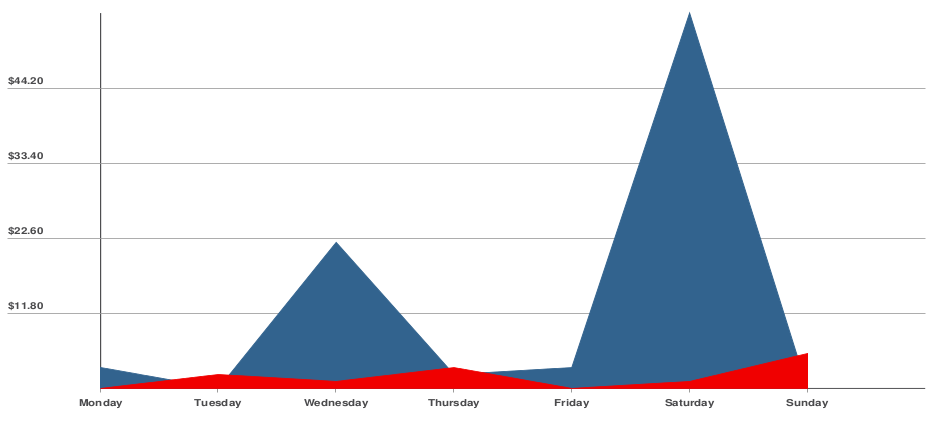

# SVG Charts 

A package for Laraver to generate SVG charts compatible with [DOMPDF](https://github.com/dompdf/dompdf). 

### Installation

Via Composer

``` bash
$ composer require dpodsiadlo/svg-charts
```

### Configuration

Once installed, register Laravel service provider, in your `config/app.php`:

```php
'providers' => [
	...
    DPodsiadlo\SvgCharts\Providers\SvgChartsServiceProvider::class,
]
```


### Basic Usage

#### Line chart




Blade template implementation:

```blade
@inject('svgCharts', '\DPodsiadlo\SvgCharts\SvgCharts')     // Injecting the service
    
lineChart([
            'labels' => [
                'Monday',
                'Tuesday',
                'Wednesday',
                'Thursday',
                'Friday',
                'Saturday',
                'Sunday'
            ],
            'data' => [
                [4,1,22,3,4,55,1],                          // First dataset
                [1,3,2,4,1,2,6]                             // Second dataset

            ]
         ],[
        'colors' => ['#32638e','#f00000'],                  // Colors for datasets
        'axisColor' => '#4a4a4c',
        'axisWidth' => 2,
        'gridColor' => '#9c9c9b',
        'gridWidth' => 1,
        'valueGroups' => 5,
        'width' => 1600,
        'height' => 900,
        'valueFormatter' => function($value){               // Closure for formatting values
            return money_format("%.2n", $value);            // Used setlocale(LC_MONETARY, 'en_US.UTF-8') for this example
        }
     ])->toImgSrc()}}"/>
```

### License

The MIT License (MIT). Please see [License File](LICENSE) for more information.
